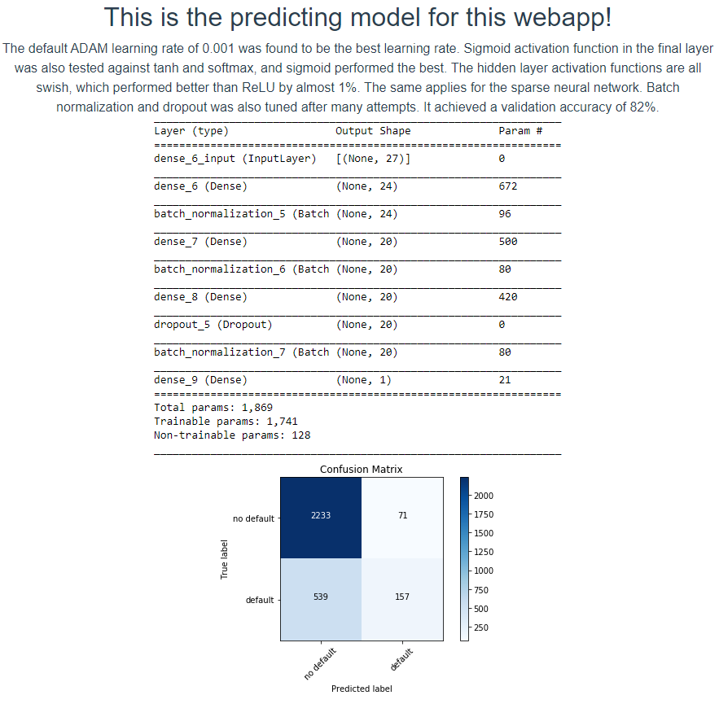
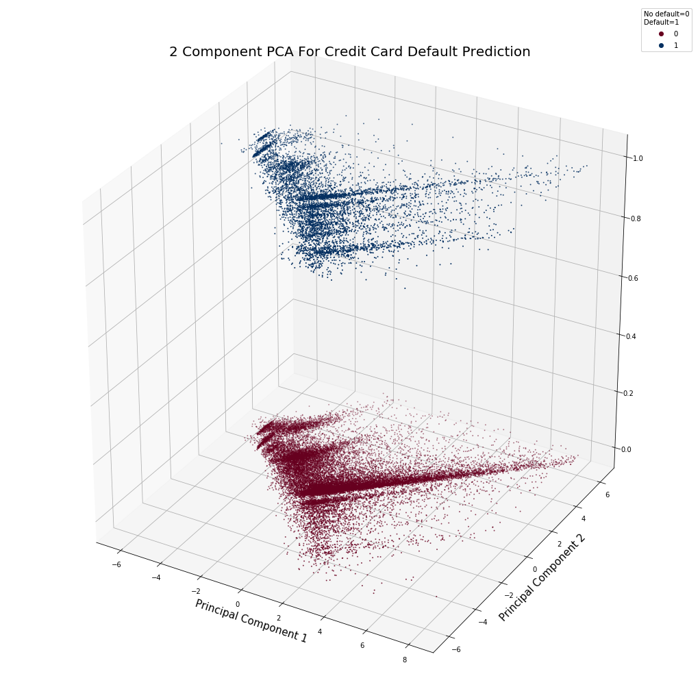
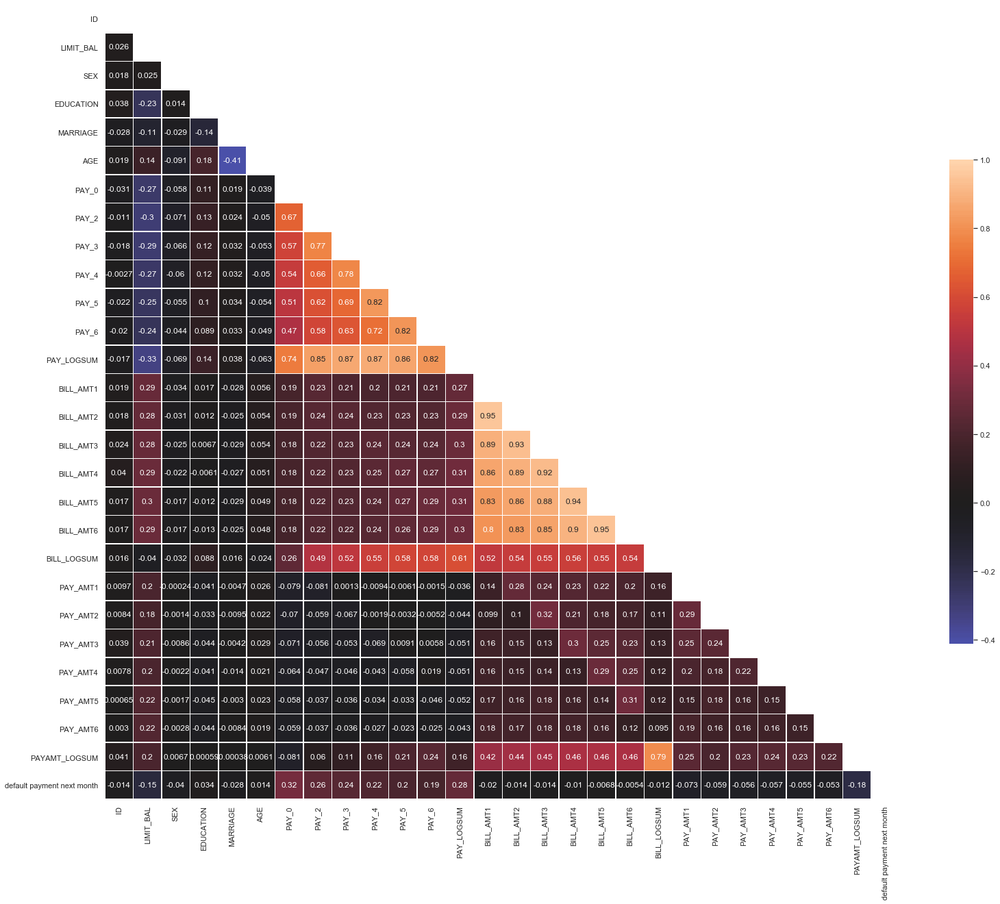

# DefaultPredictorML
Neural network webapp which predicts the probability of someone defaulting their credit card! Please visit the webapp to try out the calculator and read more about the project.

## https://ccdefaultpredictor.herokuapp.com/

Video demonstration of the backend working with the frontend:

https://www.youtube.com/watch?v=M2BRPeSJNYo&feature=youtu.be&ab_channel=SeanSmith

## Project overview

* Webapp which predicts the chance of an individual's credit card defaulting next month.

* Deployed with a tensorflow neural network in Flask API backend hosted on Heroku, achieves **82.1% binary validation accuracy** on whether an individual will default or not.

* Frontend created with VUEjs Framework hosted on Heroku seperately from the backend.

* Performed feature engineering, analyzed how each feature affects the chance of defaulting, explored the data with clustering and PCA reduction and presented my findings from the Jupyter notebook on the webapp.

* Tested/optimized 5 different supervised learning algorithms.

### Access my backend API with GET requests:

* https://ccdefaultapi.herokuapp.com/

[Click on me to make a get request to the API with some random feature values](https://ccdefaultapi.herokuapp.com/?limitbal=3445345&gender=2&education=2&marriage=1&age=55&pay0=1&pay1=1&pay2=1&pay3=1&pay4=1&pay5=1&billamt1=1&billamt2=1&billamt3=1&billamt4=1&billamt5=1&billamt6=1&payamt1=1&payamt2=1&payamt3=1&payamt4=1&payamt5=1&payamt6=1)

[Click on me to make a get request to the API with some INVALID feature values](https://ccdefaultapi.herokuapp.com/?limitbal=&gender=2&education=2&marriage=1&age=55&pay0=1&pay1=1&pay2=1&pay3=1&pay4=1&pay5=1&billamt1=1&billamt2=1&billamt3=1&billamt4=1&billamt5=1&billamt6=1&payamt1=1&payamt2=1&payamt3=1&payamt4=1&payamt5=1&payamt6=1)

## Main resources

**Python Version:** 3.7

**Tensorflow version:** 2.5.0 (tensorflow-gpu) for training/testing, 2.3.1 hosted in backend.

**Webapp styling:** https://bootstrap-vue.org/

## Visuals

### The model

## Some nice PCA reduction visuals

### The correlation matrix

### Quick sneak peak of the website

